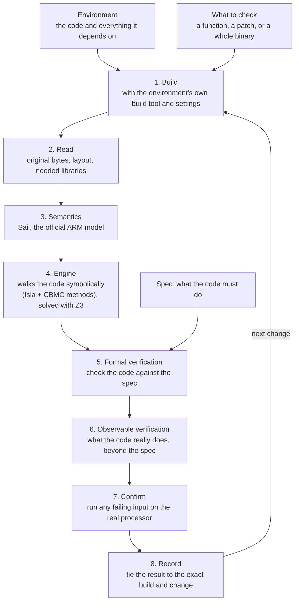

<h1 align="center">hyperray</h1>

  Proves what compiled code does, instruction by instruction, instead of testing it.
   
  <a href="#about">About</a>
  ·
  <a href="#how-it-works">How it works</a>
  ·
  <a href="CONTRIBUTING.md">Contributing</a>
  ·
  <a href="AI_POLICY.md">AI policy</a>

  
  
  
  

## About

hyperray is a reliability layer for compiled code. It takes a project,
builds it the project's own way, reads the machine code that comes out,
and proves what that code does for every input, against the official
model of the processor. The answer is a proof or a counterexample, never
a sample of test cases.

## How it works

1. **Build.** hyperray runs the environment's own build (cargo for Rust,
   the go tool for Go) with its own versions and settings, so it checks
   the exact code that ships.
2. **Read.** It reads the built program as it is: the original bytes, how
   they are laid out in memory, and the libraries the code calls.
3. **Semantics.** Each instruction gets its meaning from Sail, the
   official machine-readable model of the ARM processor, pinned to one
   version.
4. **Engine.** The engine walks the selected code symbolically, so one
   run covers every input. It builds on Isla and on methods from CBMC,
   and hands its questions to the Z3 solver.
5. **Formal verification.** The code is checked against your spec for
   every input.
6. **Observable verification.** Then the engine checks what the code
   really does on the processor's own instruction semantics, including
   behavior the spec never mentioned, such as a path that can fault or
   write out of bounds. It never goes beyond what the ISA defines.
7. **Confirm.** When the code fails, the failing input is run on the real
   processor to confirm it.
8. **Record.** The result is tied, Git-style, to the exact build and the
   change it checks.

## What you get

Every check ends in one of these answers:

| Answer | Meaning |
|---|---|
| **Proved** | The code meets the spec for every input. |
| **Disproved** | Here is an input where it does not, confirmed on the real processor. |
| **Open** | hyperray could not finish, and says where and why. This says nothing about whether the code is right. |
| **Blocked** | Something it needs is missing, such as the project's build settings. |

Each answer is tied to the exact build it came from, so a result never
outlives the code it describes.

## Status

hyperray is in early development. It does **not** yet verify a real
function end to end.

- [x] `.hray` spec format, with parser and validator
- [x] Language adapters for Rust and Go, building the whole project
- [x] Loader that reads the built program and everything it links
- [ ] Semantics: the ARM model, pinned to one version
- [ ] Engine: symbolic walk, formal and observable verification
- [ ] Confirm on the real processor
- [ ] Git-style record tying every proof to the exact build it covers
- [ ] x86 support

Expect a lot of change across the codebase, even in parts that are done.
The latest release, v0.1.2, is an earlier design.

## Contributing

See [CONTRIBUTING.md](CONTRIBUTING.md) for setup, tests, and how we work,
and [AI_POLICY.md](AI_POLICY.md) for how we use AI tools.

## License

[PolyForm Noncommercial 1.0.0](LICENSE). Free for personal use, research,
and non-profits. Commercial use needs a deal with us.
