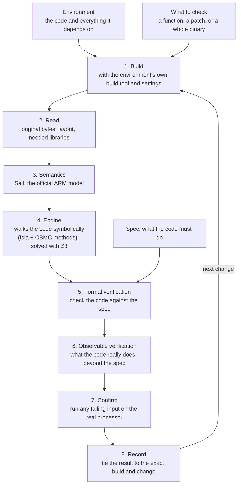

# hyperray

hyperray checks whether code really does what it is supposed to do.
It works on the compiled program, the exact machine instructions that
run, and uses proofs instead of tests.

## Why

Tests only check the inputs someone thought to write down. A change can
pass every test and still be wrong. This matters more now that AI agents
write much of the code, and benchmarks judge those agents with tests.

hyperray answers with a proof: either the code meets its requirement for
every input, or here is an input where it does not.

## How it works

1. **Build.** hyperray runs the environment's own build (cargo for Rust,
   the go tool for Go) with its own versions and settings, so it checks
   the exact code that ships.
2. **Read.** It reads the built program as it is: the original bytes, how
   they are laid out in memory, and the libraries the code calls.
3. **Semantics.** Each instruction gets its meaning from Sail, the
   official machine-readable model of the ARM processor, pinned to one
   version.
4. **Engine.** The engine walks the selected code symbolically, so one
   run covers every input. It builds on Isla and on methods from CBMC,
   and hands its questions to the Z3 solver.
5. **Formal verification.** The code is checked against your spec for
   every input.
6. **Observable verification.** Then the engine checks what the code
   really does on the processor's own instruction semantics, including
   behavior the spec never mentioned, such as a path that can fault or
   write out of bounds. It never goes beyond what the ISA defines.
7. **Confirm.** When the code fails, the failing input is run on the real
   processor to confirm it.
8. **Record.** The result is tied, Git-style, to the exact build and the
   change it checks.

hyperray works as a command-line tool and as a library, so it can judge
coding benchmarks, run inside an agent's loop, or give a training signal.

## What you get

Every check ends in one of these answers:

| Answer | Meaning |
|---|---|
| **Proved** | The code meets the spec for every input. |
| **Disproved** | Here is an input where it does not, confirmed on the real processor. |
| **Open** | hyperray could not finish, and says where and why. This says nothing about whether the code is right. |
| **Blocked** | Something it needs is missing, such as the project's build settings. |

Each answer is tied to the exact build it came from, so a result never
outlives the code it describes.

## Status

hyperray is in early development. It does **not** yet verify a real
function end to end.

- [x] `.hray` spec format, with parser and validator
      (done, but still changing as the rest takes shape)
- [ ] Language adapters that build a whole Rust or Python project
- [ ] Verification engine
- [ ] Verification: prove code meets its spec, at the ISA level
- [ ] Git-style record tying every proof to the exact build it covers
- [ ] Judge for coding benchmarks, and a training signal
- [ ] x86 support

Since hyperray is in early development, expect a lot of changes across
the codebase, even in parts that are already done. The latest release,
v0.1.2, is an earlier design.

## Repository map

| Folder | What it holds |
|---|---|
| `language/` | one adapter per language, which builds the project |
| `loader/` | reads compiled programs and decodes instructions (Rust) |
| `contract/` | the `.hray` spec format: parser and validator (Rust) |
| `solver/` | reads the solver's answers (Rust) |
| `rechecker/` | confirms counterexamples on the real processor (Rust) |
| `machine/` | the old Go engine connection, to be replaced |
| `cmd/hyperray/` | the command-line tool (Go) |
| `skills/` | instructions for AI agents writing specs |
| `docs/` | how the parts work |

## Contributing

Contributions are welcome. See [CONTRIBUTING.md](CONTRIBUTING.md) for
setup, tests, and how we work.

## License

[MIT](LICENSE)
